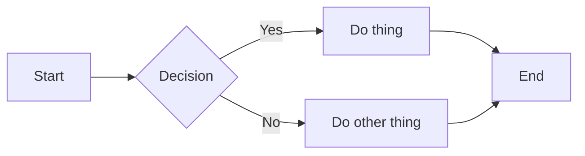

# Responsive Layout Test

This is a lede paragraph that should read comfortably at any screen width, wrapping naturally without forcing horizontal scroll on narrow viewports like phones.

## A Section With a Table

| Column A | Column B | Column C | Column D |
|----------|----------|----------|----------|
| alpha | beta | gamma | delta |
| one | two | three | four |

## A Section With a Diagram



## A Section With Code

```python
def hello(name: str) -> str:
    return f"hello, {name}"
```

- [x] Done task
- [ ] Pending task
